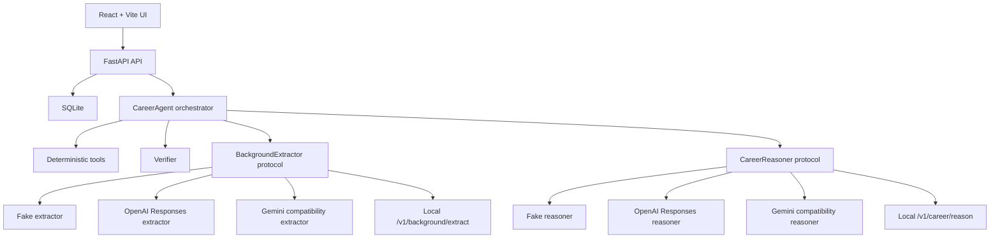

# Path Forger

Path Forger is a page-based career-navigation website that turns a user's background and career goal into a typed, evidence-grounded career plan. The current workflow includes dedicated Overview, Student, Background, Profile, Goal, Results, and Review pages, including a K-12 profile builder for users who do not yet have a conventional resume. It defaults to a Google API first mode that tries Gemini, then OpenAI when configured, then the deterministic offline demo fallback. It also has an HTTP contract for a future local multimodal/MoLE service.

## Architecture



## Setup

Prerequisites:

- Python 3.12 or newer
- Node.js 18 or newer
- pnpm

On Windows, if `python` opens the Microsoft Store or says Python was not found, use the Python launcher command `py -3` instead.

On Windows, if `node`, `npm`, or `corepack` are not recognized, install Node.js LTS, then close and reopen PowerShell:

```powershell
winget install OpenJS.NodeJS.LTS
```

After reopening PowerShell, verify Node.js is on your PATH:

```powershell
node --version
npm --version
corepack --version
```

If you just installed Node.js and those commands are still not recognized in the same PowerShell window, either close and reopen PowerShell or refresh the current session's PATH:

```powershell
$env:Path = [Environment]::GetEnvironmentVariable("Path", "Machine") + ";" + [Environment]::GetEnvironmentVariable("Path", "User")
node --version
npm --version
corepack --version
```

```powershell
py -3 -m venv .venv
.\.venv\Scripts\python.exe -m pip install -r requirements.txt
copy .env.example .env
```

Install pnpm and frontend dependencies on Windows:

```powershell
npm.cmd install --global pnpm@9
cd frontend
pnpm.cmd install
cd ..
```

If `pnpm.cmd install` asks to remove and reinstall `node_modules`, answer `Y`.

You can also install pnpm through Corepack:

```powershell
corepack enable
corepack prepare pnpm@9 --activate
cd frontend
pnpm.cmd install
cd ..
```

If PowerShell blocks `npm.ps1` because script execution is disabled, keep using the `.cmd` launchers:

```powershell
npm.cmd install --global pnpm@9
cd frontend
pnpm.cmd install
cd ..
```

Use the same `.cmd` workaround if `corepack enable` fails with `EPERM` while trying to write to `C:\Program Files\nodejs`.

For the default Google API first mode, set `GEMINI_API_KEY` in your shell or `.env`. Add `OPENAI_API_KEY` only if you want OpenAI fallback before the offline demo. Do not commit `.env`.

PowerShell uses `$env:` when setting environment variables for the current terminal:

```powershell
$env:PATHFORGE_PROVIDER_MODE="hybrid-gemini-first"
$env:GEMINI_API_KEY="your-gemini-key"
```

In `.env`, use plain `NAME=value` lines instead:

```env
PATHFORGE_PROVIDER_MODE=hybrid-gemini-first
GEMINI_API_KEY=your-gemini-key
```

## Run Backend And Frontend

Start the backend and frontend in two separate terminals.

Terminal 1, from the repo root:

```powershell
$env:PATHFORGE_PROVIDER_MODE="hybrid-gemini-first"
.\.venv\Scripts\python.exe -m uvicorn app.main:app --app-dir backend --reload
```

Backend URL: `http://localhost:8000`

Health check: `http://localhost:8000/api/health`

Terminal 2, from the repo root:

```powershell
cd frontend
pnpm.cmd install
pnpm.cmd dev
```

Frontend URL: `http://localhost:5173`

The frontend calls `http://localhost:8000` by default. If you run the backend on a different URL, set `VITE_API_BASE_URL` before starting Vite:

```powershell
cd frontend
$env:VITE_API_BASE_URL="http://localhost:8001"
pnpm.cmd dev
```

To serve the compiled website from FastAPI, build the frontend first:

```powershell
cd frontend
pnpm.cmd build
cd ..
.\.venv\Scripts\python.exe -m uvicorn app.main:app --app-dir backend
```

Website URL: `http://localhost:8000`

If PowerShell says `pnpm` is not recognized, install Node.js, reopen PowerShell, and run the frontend dependency commands from the setup section again.

## Provider Modes

- `fake`: deterministic, offline demo and test mode.
- `openai`: uses the OpenAI Python SDK and Responses API.
- `gemini`: uses the OpenAI Python SDK against Google's OpenAI-compatible Gemini endpoint.
- `qwen`: runs `Qwen/Qwen3-4B-Instruct-2507` locally through Hugging Face Transformers.
- `local`: calls the partner local service.
- `hybrid-local-first`: tries local first, then OpenAI when enabled; falls back once.
- `hybrid-openai-first`: tries OpenAI first, then local; falls back once.
- `hybrid-gemini-first`: tries Gemini first, then OpenAI if `OPENAI_API_KEY` is configured, otherwise fake fallback.

Key environment variables:

- `PATHFORGE_PROVIDER_MODE`
- `PATHFORGE_DATABASE_URL`
- `OPENAI_API_KEY`
- `OPENAI_MODEL`
- `GEMINI_API_KEY`
- `GEMINI_MODEL`
- `GEMINI_BASE_URL`
- `QWEN_MODEL`
- `QWEN_MAX_NEW_TOKENS`
- `QWEN_MAX_INPUT_CHARS`
- `QWEN_DEVICE_MAP`
- `QWEN_TORCH_DTYPE`
- `QWEN_FAST_BACKGROUND_EXTRACTION`
- `LOCAL_MODEL_BASE_URL`
- `LOCAL_MODEL_TIMEOUT_SECONDS`
- `PATHFORGE_ENABLE_OPENAI_FALLBACK`
- `PATHFORGE_MAX_UPLOAD_BYTES`

## API

- `POST /api/profiles/extract`
- `POST /api/profiles`
- `GET /api/profiles/{id}`
- `POST /api/career-plan`
- `GET /api/runs/{id}`
- `GET /api/health`

## Local MoLE Contract

The agent expects the future local service to provide:

- `GET /health`
- `GET /v1/capabilities`
- `POST /v1/background/extract`
- `POST /v1/career/reason`

`POST /v1/career/reason` receives `run_id`, `profile`, `goal`, `evidence`, `task`, `routing`, and `generation`. It returns a typed `plan`, optional `routing_trace`, and `model_trace`. The agent never loads LoRA/PEFT adapters; the local service owns model internals and routing.

## Tests

```powershell
.\.venv\Scripts\python.exe -m pytest backend/tests -q
```

Coverage includes schema validation, deterministic tools, fake provider runs, OpenAI provider mocking at the SDK boundary, local contract parsing, timeout/schema fallback, verifier checks, counterfactual behavior, and one FastAPI end-to-end test.

## Provider Smoke Tests

```powershell
python backend/scripts/smoke_openai.py
python backend/scripts/smoke_gemini.py
```

To use Gemini without spending OpenAI credits, set:

```env
PATHFORGE_PROVIDER_MODE=gemini
GEMINI_API_KEY=your-gemini-key
GEMINI_MODEL=gemini-3.6-flash
```

## Local Qwen Provider

The Qwen provider uses Hugging Face Transformers with `Qwen/Qwen3-4B-Instruct-2507`. Install the optional local model dependencies first:

```powershell
.\.venv\Scripts\python.exe -m pip install -r requirements-qwen.txt
```

Then run the backend with Qwen:

```powershell
$env:PATHFORGE_PROVIDER_MODE="qwen"
$env:QWEN_MODEL="Qwen/Qwen3-4B-Instruct-2507"
.\.venv\Scripts\python.exe -m uvicorn app.main:app --app-dir backend --reload
```

The first Qwen run downloads the model from Hugging Face and needs enough local RAM/VRAM for a 4B parameter model. If you run out of memory, use Gemini/OpenAI, a smaller/quantized local model through a local service, or reduce local inference settings.

After installing Qwen dependencies, check whether PyTorch can see your GPU:

```powershell
.\.venv\Scripts\python.exe -c "import torch; print(torch.__version__); print(torch.cuda.is_available()); print(torch.version.cuda); print(torch.cuda.get_device_name(0) if torch.cuda.is_available() else 'no cuda')"
```

If this prints `False` or `+cpu`, Qwen is running on CPU even if `nvidia-smi` sees your GPU. Install a CUDA PyTorch wheel instead. For a Pascal GPU such as a GTX 1080 Ti, CUDA 12.6 wheels are a good starting point:

```powershell
.\.venv\Scripts\python.exe -m pip uninstall -y torch torchvision torchaudio
.\.venv\Scripts\python.exe -m pip install torch torchvision torchaudio --index-url https://download.pytorch.org/whl/cu126
```

Qwen can be slow on large documents. By default, Path Forger sends only the first 12,000 characters of an uploaded document to Qwen background extraction:

```powershell
$env:QWEN_MAX_INPUT_CHARS="12000"
```

Path Forger also keeps Qwen background intake fast by default:

```powershell
$env:QWEN_FAST_BACKGROUND_EXTRACTION="true"
```

With that setting, Qwen mode uses the fast deterministic extractor for `Build Background Prompt` and `Extract Profile`, then uses Qwen for the slower `Run Agent` reasoning step. To force Qwen to perform background extraction too, set `QWEN_FAST_BACKGROUND_EXTRACTION=false`.

If the backend logs say `Some parameters are on the meta device because they were offloaded to the disk and cpu`, Qwen loaded successfully but your machine did not have enough fast memory for the whole model. Requests may still complete, but CPU/disk offload can make generation take several minutes or longer. For faster local testing, paste a shorter background or use the guided background questions before running the agent.

For an older 11 GB GPU such as a GTX 1080 Ti, start with smaller local-inference settings:

```powershell
$env:PATHFORGE_PROVIDER_MODE="qwen"
$env:QWEN_TORCH_DTYPE="float16"
$env:QWEN_MAX_INPUT_CHARS="4000"
$env:QWEN_MAX_NEW_TOKENS="700"
$env:QWEN_FAST_BACKGROUND_EXTRACTION="true"
.\.venv\Scripts\python.exe -m uvicorn app.main:app --app-dir backend --reload
```

If it still offloads to CPU/disk, use a smaller or quantized local model through a dedicated local runtime, or switch to Gemini/OpenAI for faster hosted inference.

## Evaluation

```powershell
python backend/scripts/evaluate.py --provider fake --output backend/evaluation/results.json
```

The runner captures schema success, verifier warnings, evidence coverage, latency, provider/fallback, tool count, and routing trace when present. It includes five synthetic personas and a counterfactual test in the automated suite.

## Known Limitations

- PDF parsing uses `pypdf` text extraction and works best with text-based PDFs; scanned PDFs still need OCR before upload.
- Deterministic role evidence is a fixture in fake/local tests. OpenAI mode can enrich plans with hosted web search citations.
- Gemini is integrated through Google's OpenAI-compatible endpoint; provider-specific Gemini tools such as Google Search grounding are not wired yet.
- Qwen local inference depends on local hardware and the installed `transformers`/`torch` stack. The first run downloads model weights from Hugging Face.
- The fake provider is for demos and CI, not production-quality reasoning.
- Local MoLE endpoints are contract clients until the partner service is available.
